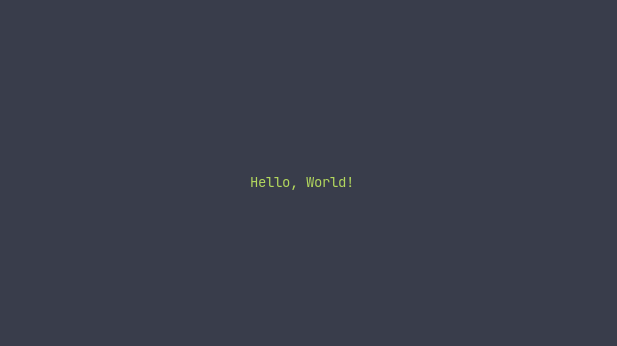

# playt (play with the terminal)

read like plate, playt with fun

## Hello, World!

```rs
// in examples/hello.rs

use playt::prelude::*;
use pancurses::{Window, Input};

fn main() -> Result<(), Box<dyn std::error::Error>> {
    let mut game = Game::with_colors(())
        .expect("couldn't initialize with colors");
    
    let mut stage = Stage::new(())
        .clear_on_resize(true)
        .draw(|_, _, win| -> Result<(), ()> {
            let greeting = "Hello, World!";
            win.attron(color::GREEN_ON_BLACK);
            win.mvprintw(win.get_mid_y(0), win.get_mid_x(greeting.len() as i32), greeting);
            win.attroff(color::GREEN_ON_BLACK);
            Ok(())
        })
        .update(|game, _, input| {
            if let Some(Input::Character('q')) = input {
                game.stop();
            }
            Ok(())
        })
        .build();
    
    while game.is_running() {
        game.perform(&mut stage).unwrap();
    }
    Ok(())
}
```

Result: <br><center>

</center>
